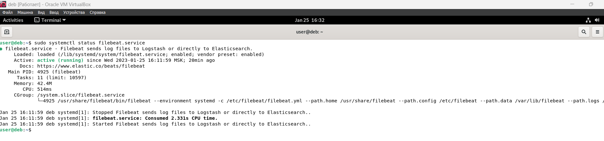
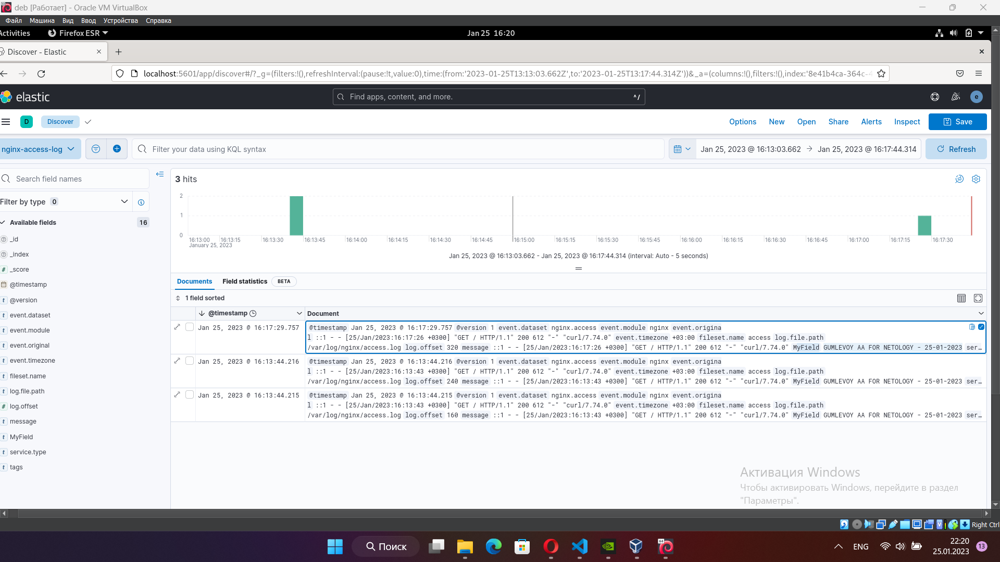
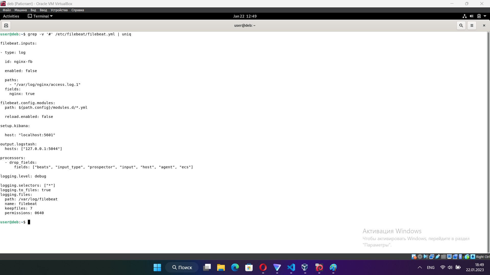

# 11.3 ELK - Александр Гумлевой
### Задание 1. Elasticsearch.

Установите и запустите Elasticsearch, после чего поменяйте параметр cluster_name на случайный.


### Задание 2. Kibana.

Установите и запустите Kibana.


### Задание 3. Logstash.

Установите и запустите Logstash и Nginx. С помощью Logstash отправьте access-лог Nginx в Elasticsearch.


<details>
  <summary>Nginx log</summary>
  
  ```
::1 - - [21/Jan/2023:13:36:11 +0300] "GET / HTTP/1.1" 200 612 "-" "curl/7.74.0"
::1 - - [21/Jan/2023:13:36:12 +0300] "GET / HTTP/1.1" 200 612 "-" "curl/7.74.0"
::1 - - [21/Jan/2023:13:36:13 +0300] "GET / HTTP/1.1" 200 612 "-" "curl/7.74.0"
::1 - - [21/Jan/2023:13:36:14 +0300] "GET / HTTP/1.1" 200 612 "-" "curl/7.74.0"
::1 - - [21/Jan/2023:13:43:28 +0300] "GET / HTTP/1.1" 200 612 "-" "curl/7.74.0"
::1 - - [21/Jan/2023:13:43:29 +0300] "GET / HTTP/1.1" 200 612 "-" "curl/7.74.0"
::1 - - [21/Jan/2023:13:48:47 +0300] "GET / HTTP/1.1" 200 612 "-" "curl/7.74.0"
::1 - - [21/Jan/2023:13:48:48 +0300] "GET / HTTP/1.1" 200 612 "-" "curl/7.74.0"
::1 - - [21/Jan/2023:13:48:48 +0300] "GET / HTTP/1.1" 200 612 "-" "curl/7.74.0"
::1 - - [21/Jan/2023:13:48:49 +0300] "GET / HTTP/1.1" 200 612 "-" "curl/7.74.0"
::1 - - [21/Jan/2023:13:53:29 +0300] "GET / HTTP/1.1" 200 612 "-" "curl/7.74.0"
::1 - - [21/Jan/2023:13:53:30 +0300] "GET / HTTP/1.1" 200 612 "-" "curl/7.74.0"
::1 - - [21/Jan/2023:13:53:30 +0300] "GET / HTTP/1.1" 200 612 "-" "curl/7.74.0"
::1 - - [21/Jan/2023:14:04:51 +0300] "GET / HTTP/1.1" 200 612 "-" "curl/7.74.0"
::1 - - [21/Jan/2023:14:04:52 +0300] "GET / HTTP/1.1" 200 612 "-" "curl/7.74.0"
::1 - - [21/Jan/2023:14:04:53 +0300] "GET / HTTP/1.1" 200 612 "-" "curl/7.74.0"
::1 - - [21/Jan/2023:14:08:24 +0300] "GET / HTTP/1.1" 200 612 "-" "curl/7.74.0"
127.0.0.1 - - [21/Jan/2023:14:46:39 +0300] "GET / HTTP/1.1" 200 612 "-" "curl/7.74.0"
127.0.0.1 - - [21/Jan/2023:14:51:33 +0300] "GET / HTTP/1.1" 200 612 "-" "curl/7.74.0"
127.0.0.1 - - [21/Jan/2023:14:51:34 +0300] "GET / HTTP/1.1" 200 612 "-" "curl/7.74.0"
127.0.0.1 - - [21/Jan/2023:15:00:42 +0300] "GET / HTTP/1.1" 200 612 "-" "curl/7.74.0"
::1 - - [21/Jan/2023:16:10:43 +0300] "GET / HTTP/1.1" 200 612 "-" "curl/7.74.0"
::1 - - [21/Jan/2023:16:10:44 +0300] "GET / HTTP/1.1" 200 612 "-" "curl/7.74.0"
::1 - - [21/Jan/2023:17:25:59 +0300] "GET / HTTP/1.1" 200 612 "-" "curl/7.74.0"
::1 - - [21/Jan/2023:17:31:37 +0300] "GET / HTTP/1.1" 200 612 "-" "curl/7.74.0"
::1 - - [21/Jan/2023:17:35:25 +0300] "GET / HTTP/1.1" 200 612 "-" "curl/7.74.0"
::1 - - [21/Jan/2023:17:35:39 +0300] "GET / HTTP/1.1" 200 612 "-" "curl/7.74.0"
::1 - - [21/Jan/2023:17:35:40 +0300] "GET / HTTP/1.1" 200 612 "-" "curl/7.74.0"
::1 - - [21/Jan/2023:17:35:41 +0300] "GET / HTTP/1.1" 200 612 "-" "curl/7.74.0"
::1 - - [21/Jan/2023:17:44:08 +0300] "GET / HTTP/1.1" 200 612 "-" "curl/7.74.0"
::1 - - [21/Jan/2023:17:44:19 +0300] "GET / HTTP/1.1" 200 612 "-" "curl/7.74.0"
::1 - - [21/Jan/2023:17:44:20 +0300] "GET / HTTP/1.1" 200 612 "-" "curl/7.74.0"
::1 - - [21/Jan/2023:18:05:49 +0300] "GET / HTTP/1.1" 200 612 "-" "curl/7.74.0"
::1 - - [21/Jan/2023:18:05:50 +0300] "GET / HTTP/1.1" 200 612 "-" "curl/7.74.0"
::1 - - [21/Jan/2023:18:05:50 +0300] "GET / HTTP/1.1" 200 612 "-" "curl/7.74.0"
::1 - - [21/Jan/2023:18:05:51 +0300] "GET / HTTP/1.1" 200 612 "-" "curl/7.74.0"
::1 - - [21/Jan/2023:18:05:51 +0300] "GET / HTTP/1.1" 200 612 "-" "curl/7.74.0"
::1 - - [21/Jan/2023:18:05:52 +0300] "GET / HTTP/1.1" 200 612 "-" "curl/7.74.0"
::1 - - [21/Jan/2023:18:05:52 +0300] "GET / HTTP/1.1" 200 612 "-" "curl/7.74.0"
::1 - - [21/Jan/2023:18:05:52 +0300] "GET / HTTP/1.1" 200 612 "-" "curl/7.74.0"
::1 - - [21/Jan/2023:18:05:53 +0300] "GET / HTTP/1.1" 200 612 "-" "curl/7.74.0"
::1 - - [21/Jan/2023:18:05:53 +0300] "GET / HTTP/1.1" 200 612 "-" "curl/7.74.0"
::1 - - [21/Jan/2023:18:05:53 +0300] "GET / HTTP/1.1" 200 612 "-" "curl/7.74.0"
::1 - - [21/Jan/2023:18:05:54 +0300] "GET / HTTP/1.1" 200 612 "-" "curl/7.74.0"
::1 - - [21/Jan/2023:18:05:54 +0300] "GET / HTTP/1.1" 200 612 "-" "curl/7.74.0"
::1 - - [21/Jan/2023:18:05:55 +0300] "GET / HTTP/1.1" 200 612 "-" "curl/7.74.0"
::1 - - [21/Jan/2023:18:05:55 +0300] "GET / HTTP/1.1" 200 612 "-" "curl/7.74.0"
::1 - - [21/Jan/2023:18:05:55 +0300] "GET / HTTP/1.1" 200 612 "-" "curl/7.74.0"
::1 - - [21/Jan/2023:18:05:56 +0300] "GET / HTTP/1.1" 200 612 "-" "curl/7.74.0"
::1 - - [21/Jan/2023:18:05:56 +0300] "GET / HTTP/1.1" 200 612 "-" "curl/7.74.0"
::1 - - [21/Jan/2023:18:05:56 +0300] "GET / HTTP/1.1" 200 612 "-" "curl/7.74.0"
::1 - - [21/Jan/2023:18:05:57 +0300] "GET / HTTP/1.1" 200 612 "-" "curl/7.74.0"
::1 - - [21/Jan/2023:18:05:57 +0300] "GET / HTTP/1.1" 200 612 "-" "curl/7.74.0"
::1 - - [21/Jan/2023:18:05:58 +0300] "GET / HTTP/1.1" 200 612 "-" "curl/7.74.0"
::1 - - [21/Jan/2023:18:05:59 +0300] "GET / HTTP/1.1" 200 612 "-" "curl/7.74.0"
::1 - - [21/Jan/2023:18:09:15 +0300] "GET / HTTP/1.1" 200 612 "-" "curl/7.74.0"
::1 - - [21/Jan/2023:18:09:16 +0300] "GET / HTTP/1.1" 200 612 "-" "curl/7.74.0"
::1 - - [21/Jan/2023:18:09:17 +0300] "GET / HTTP/1.1" 200 612 "-" "curl/7.74.0"
::1 - - [21/Jan/2023:18:09:18 +0300] "GET / HTTP/1.1" 200 612 "-" "curl/7.74.0"
::1 - - [21/Jan/2023:18:09:19 +0300] "GET / HTTP/1.1" 200 612 "-" "curl/7.74.0"
::1 - - [21/Jan/2023:18:09:20 +0300] "GET / HTTP/1.1" 200 612 "-" "curl/7.74.0"
::1 - - [21/Jan/2023:18:09:21 +0300] "GET / HTTP/1.1" 200 612 "-" "curl/7.74.0"
::1 - - [21/Jan/2023:18:09:22 +0300] "GET / HTTP/1.1" 200 612 "-" "curl/7.74.0"
::1 - - [21/Jan/2023:18:09:23 +0300] "GET / HTTP/1.1" 200 612 "-" "curl/7.74.0"
::1 - - [21/Jan/2023:18:09:24 +0300] "GET / HTTP/1.1" 200 612 "-" "curl/7.74.0"
::1 - - [21/Jan/2023:18:09:25 +0300] "GET / HTTP/1.1" 200 612 "-" "curl/7.74.0"
::1 - - [21/Jan/2023:18:09:26 +0300] "GET / HTTP/1.1" 200 612 "-" "curl/7.74.0"
::1 - - [21/Jan/2023:18:09:27 +0300] "GET / HTTP/1.1" 200 612 "-" "curl/7.74.0"
::1 - - [21/Jan/2023:18:09:28 +0300] "GET / HTTP/1.1" 200 612 "-" "curl/7.74.0"
::1 - - [21/Jan/2023:18:09:29 +0300] "GET / HTTP/1.1" 200 612 "-" "curl/7.74.0"
::1 - - [21/Jan/2023:18:09:30 +0300] "GET / HTTP/1.1" 200 612 "-" "curl/7.74.0"
::1 - - [21/Jan/2023:18:09:31 +0300] "GET / HTTP/1.1" 200 612 "-" "curl/7.74.0"
::1 - - [21/Jan/2023:18:09:32 +0300] "GET / HTTP/1.1" 200 612 "-" "curl/7.74.0"
::1 - - [21/Jan/2023:18:09:33 +0300] "GET / HTTP/1.1" 200 612 "-" "curl/7.74.0"
::1 - - [21/Jan/2023:18:09:34 +0300] "GET / HTTP/1.1" 200 612 "-" "curl/7.74.0"
::1 - - [21/Jan/2023:18:09:35 +0300] "GET / HTTP/1.1" 200 612 "-" "curl/7.74.0"
::1 - - [21/Jan/2023:18:09:36 +0300] "GET / HTTP/1.1" 200 612 "-" "curl/7.74.0"
::1 - - [21/Jan/2023:18:09:37 +0300] "GET / HTTP/1.1" 200 612 "-" "curl/7.74.0"
::1 - - [21/Jan/2023:18:10:02 +0300] "GET / HTTP/1.1" 200 612 "-" "curl/7.74.0"
::1 - - [21/Jan/2023:18:10:03 +0300] "GET / HTTP/1.1" 200 612 "-" "curl/7.74.0"
::1 - - [21/Jan/2023:18:10:04 +0300] "GET / HTTP/1.1" 200 612 "-" "curl/7.74.0"
::1 - - [21/Jan/2023:18:10:05 +0300] "GET / HTTP/1.1" 200 612 "-" "curl/7.74.0"
::1 - - [21/Jan/2023:18:10:06 +0300] "GET / HTTP/1.1" 200 612 "-" "curl/7.74.0"
::1 - - [21/Jan/2023:18:10:07 +0300] "GET / HTTP/1.1" 200 612 "-" "curl/7.74.0"
  ```
</details>


### Задание 4. Filebeat.

Установите и запустите Filebeat. Переключите поставку логов Nginx с Logstash на Filebeat.








Логи nginx.


<details>
  <summary>Nginx log</summary>
  
  ```
::1 - - [22/Jan/2023:09:27:14 +0300] "GET / HTTP/1.1" 200 612 "-" "curl/7.74.0"
::1 - - [22/Jan/2023:09:27:15 +0300] "GET / HTTP/1.1" 200 612 "-" "curl/7.74.0"
::1 - - [22/Jan/2023:09:27:17 +0300] "GET / HTTP/1.1" 200 612 "-" "curl/7.74.0"
::1 - - [22/Jan/2023:09:27:18 +0300] "GET / HTTP/1.1" 200 612 "-" "curl/7.74.0"
::1 - - [22/Jan/2023:09:27:18 +0300] "GET / HTTP/1.1" 200 612 "-" "curl/7.74.0"
::1 - - [22/Jan/2023:09:27:19 +0300] "GET / HTTP/1.1" 200 612 "-" "curl/7.74.0"
::1 - - [22/Jan/2023:09:27:19 +0300] "GET / HTTP/1.1" 200 612 "-" "curl/7.74.0"
::1 - - [22/Jan/2023:09:27:20 +0300] "GET / HTTP/1.1" 200 612 "-" "curl/7.74.0"
::1 - - [22/Jan/2023:09:27:20 +0300] "GET / HTTP/1.1" 200 612 "-" "curl/7.74.0"
::1 - - [22/Jan/2023:09:27:21 +0300] "GET / HTTP/1.1" 200 612 "-" "curl/7.74.0"
::1 - - [22/Jan/2023:09:27:21 +0300] "GET / HTTP/1.1" 200 612 "-" "curl/7.74.0"
::1 - - [22/Jan/2023:09:27:22 +0300] "GET / HTTP/1.1" 200 612 "-" "curl/7.74.0"
::1 - - [22/Jan/2023:09:27:22 +0300] "GET / HTTP/1.1" 200 612 "-" "curl/7.74.0"
::1 - - [22/Jan/2023:09:27:23 +0300] "GET / HTTP/1.1" 200 612 "-" "curl/7.74.0"
::1 - - [22/Jan/2023:09:27:23 +0300] "GET / HTTP/1.1" 200 612 "-" "curl/7.74.0"
::1 - - [22/Jan/2023:09:27:23 +0300] "GET / HTTP/1.1" 200 612 "-" "curl/7.74.0"
::1 - - [22/Jan/2023:09:27:24 +0300] "GET / HTTP/1.1" 200 612 "-" "curl/7.74.0"
::1 - - [22/Jan/2023:09:27:24 +0300] "GET / HTTP/1.1" 200 612 "-" "curl/7.74.0"
::1 - - [22/Jan/2023:09:27:25 +0300] "GET / HTTP/1.1" 200 612 "-" "curl/7.74.0"
::1 - - [22/Jan/2023:09:27:25 +0300] "GET / HTTP/1.1" 200 612 "-" "curl/7.74.0"
::1 - - [22/Jan/2023:09:27:26 +0300] "GET / HTTP/1.1" 200 612 "-" "curl/7.74.0"
::1 - - [22/Jan/2023:09:27:26 +0300] "GET / HTTP/1.1" 200 612 "-" "curl/7.74.0"
::1 - - [22/Jan/2023:09:27:26 +0300] "GET / HTTP/1.1" 200 612 "-" "curl/7.74.0"
::1 - - [22/Jan/2023:09:27:28 +0300] "GET / HTTP/1.1" 200 612 "-" "curl/7.74.0"
::1 - - [22/Jan/2023:09:27:28 +0300] "GET / HTTP/1.1" 200 612 "-" "curl/7.74.0"
::1 - - [22/Jan/2023:09:27:28 +0300] "GET / HTTP/1.1" 200 612 "-" "curl/7.74.0"
::1 - - [22/Jan/2023:09:27:29 +0300] "GET / HTTP/1.1" 200 612 "-" "curl/7.74.0"
::1 - - [22/Jan/2023:09:27:29 +0300] "GET / HTTP/1.1" 200 612 "-" "curl/7.74.0"
::1 - - [22/Jan/2023:09:27:30 +0300] "GET / HTTP/1.1" 200 612 "-" "curl/7.74.0"
::1 - - [22/Jan/2023:09:27:32 +0300] "GET / HTTP/1.1" 200 612 "-" "curl/7.74.0"
::1 - - [22/Jan/2023:09:27:32 +0300] "GET / HTTP/1.1" 200 612 "-" "curl/7.74.0"
::1 - - [22/Jan/2023:10:45:20 +0300] "GET / HTTP/1.1" 200 612 "-" "curl/7.74.0"
::1 - - [22/Jan/2023:10:45:21 +0300] "GET / HTTP/1.1" 200 612 "-" "curl/7.74.0"
::1 - - [22/Jan/2023:10:45:22 +0300] "GET / HTTP/1.1" 200 612 "-" "curl/7.74.0"
::1 - - [22/Jan/2023:10:45:22 +0300] "GET / HTTP/1.1" 200 612 "-" "curl/7.74.0"
::1 - - [22/Jan/2023:10:45:23 +0300] "GET / HTTP/1.1" 200 612 "-" "curl/7.74.0"
::1 - - [22/Jan/2023:12:31:58 +0300] "GET / HTTP/1.1" 200 612 "-" "curl/7.74.0"
::1 - - [22/Jan/2023:12:35:00 +0300] "GET / HTTP/1.1" 200 612 "-" "curl/7.74.0"
  ```
</details>